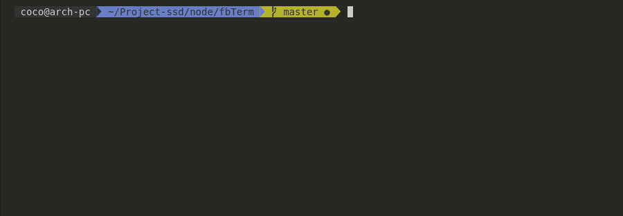

# FbTerm


## Install
``` bash
    git clone git@github.com:clabroche/fbTerm.git
    cd fbTerm
    npm i 
```

## Usage

Create a ```credentials.json``` into root project containing: 
``` json
{
    "email": "<Facebook email>",
    "password": "<Facebook password>"
}
```
``` bash
    npm run start 
```

## TODO

 - Get friends list from another location to have all or have "+" buttons to load more
 - Refresh friend list on send msg
 - Do not refresh friends list on send msg to speedup 