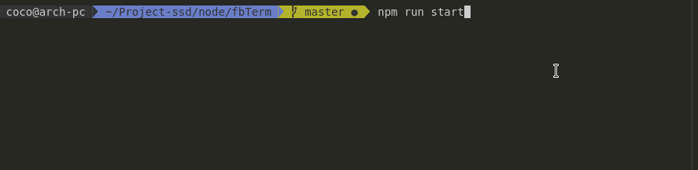

# FbTerm


## Install
``` bash
    git clone git@github.com:clabroche/fbTerm.git
    cd fbTerm
    npm i 
```

## Usage

Create a ```credentials.json``` into root project containing: 
``` json
{
    "email": "<Facebook email>",
    "password": "<Facebook password>"
}
```
``` bash
    npm run start 
```